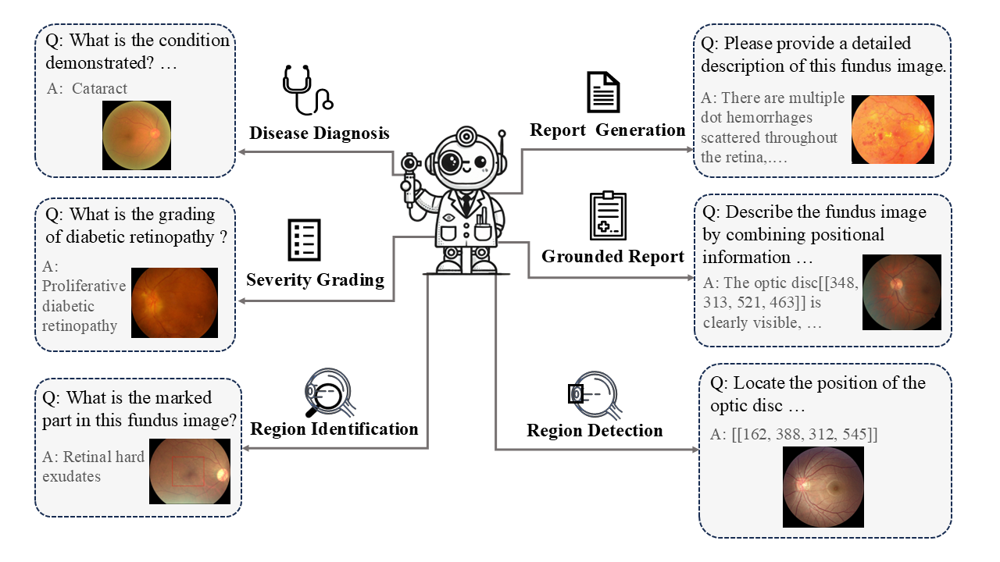

# FundusExpert
This repository is the official implementation of the paper **Constructing Ophthalmic MLLM for Positioning-diagnosis Collaboration Through Clinical Cognitive Chain Reasoning**.

[🌐 Conference](https://iccv.thecvf.com/virtual/2025/poster/1667) | [📝 Publication](https://openaccess.thecvf.com/content/ICCV2025/html/Liu_Constructing_Ophthalmic_MLLM_for_Positioning-diagnosis_Collaboration_Through_Clinical_Cognitive_Chain_ICCV_2025_paper.html) | [📖 arXiv](https://arxiv.org/abs/2507.17539)

[🤗 Model](https://huggingface.co/MeteorElf/FundusExpert) | [🤗 Dataset](https://huggingface.co/datasets/MeteorElf/Fundus-MMBench)

## Introduction



This paper introduces FundusExpert, an ophthalmology-specific MLLM with integrated positioning-diagnosis reasoning capabilities, along with FundusGen, a dataset constructed through the intelligent Fundus-Engine system.

## Data Processing

[📌 Data Processing Doc](./data_processing/README.md)

## Setup

Clone this repository and install the dependencies.

Please refer to [InternVL Installation](https://internvl.readthedocs.io/en/latest/get_started/installation.html) or use the `src/internvl25_requirements.txt` to build the environment.

### Quick Start

Inference with single GPU:

```
python src/quick_start.py
```

## Evaluation

[📌 Evaluation Doc](./src/eval/README.md)

## Contact
Xinyao Liu: liuxinyao@mail.ustc.edu.cn

Diping Song: songdiping@pjlab.org.cn

## Acknowledgements

Our model is based on [OpenGVLab/InternVL](https://github.com/OpenGVLab/InternVL). Our evaluation code is based on [open-compass/VLMEvalKit](https://github.com/open-compass/VLMEvalKit). Our segmentation model and code come from [MIC-DKFZ/nnUNet](https://github.com/MIC-DKFZ/nnUNet). We would like to thank their excellent work and open source contributions.

